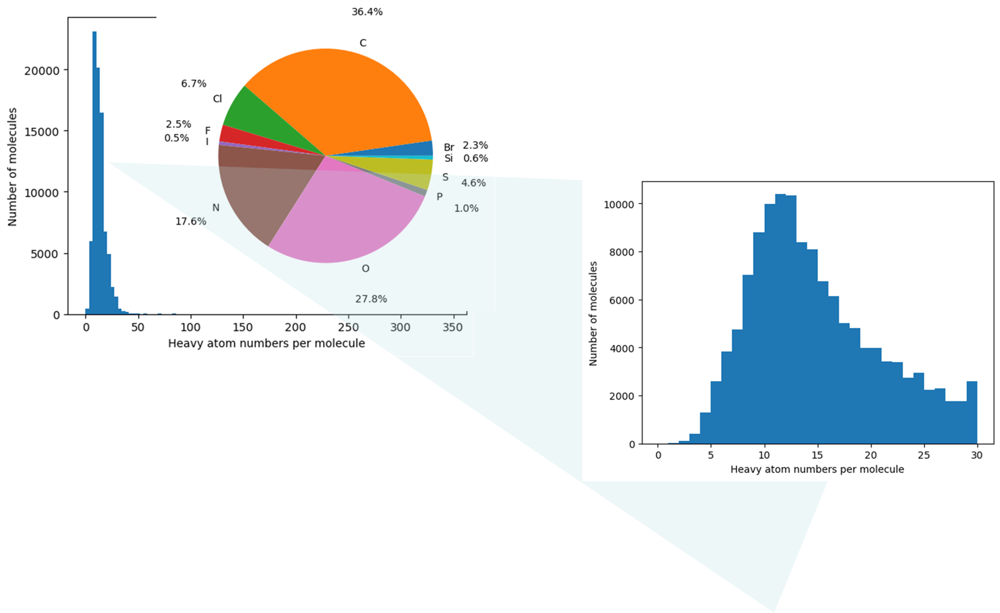

# Spectrum-SMILES Translation Language Model
This repo aims at testifying **experimental spectra** for spectrum-SMILES translation, despite most publications focusing only on simulated spectrum, and limited heavy atom types.

## Dataset
Experimental spectra of small organic molecules
  - 130 k+ IR spectra
    
  - 12 k+ Raman spectra
    

## Model
- Vanilla Transformer with encoder-decoder architecture for auto-regression
